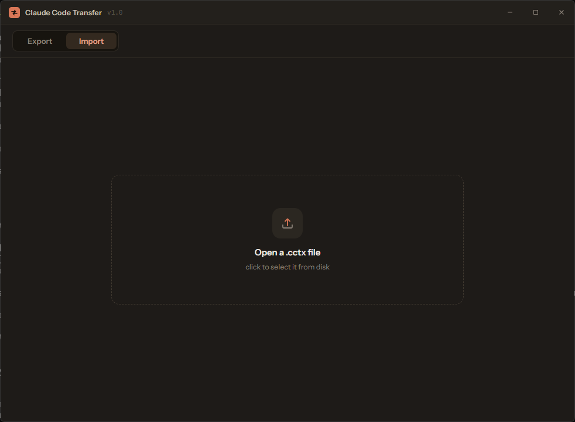

# Claude Code Transfer

A desktop app (Windows) to copy your **Claude Code chats and their project files**
from one PC to another — no cloud, no online sync. Export a single `.cctx`
package on one machine, carry it however you like (USB, LAN share, whatever),
and import it on another. Paths are remapped automatically when the Windows
user is different, so your sessions keep working.




## Why

Claude Code stores each project's conversations under `~/.claude/projects/<slug>/`
and the actual code lives in the project folder. Moving between machines by hand
means copying scattered `.jsonl` files, fixing absolute paths inside them, and
hoping nothing breaks. This app does it in two clicks and rewrites the paths for
you.

## Features

- **Pick what you move** — all projects, some projects, or individual sessions.
- **Project files included** (optional, per project) with configurable exclusions
  (`node_modules`, `.git`, `venv`, `target`, `dist`, `__pycache__`, plus your own).
- **Automatic path remapping** on import — the `~/.claude/projects` slug and every
  absolute path inside the `.jsonl` files (at any JSON escaping depth) are rewritten
  to the destination user/location.
- **Conflict handling per project** — merge (keep existing sessions) or overwrite;
  for files, optionally write only newer ones. Nothing is clobbered silently.
- **Optional global configuration** — `settings.json`, `settings.local.json`,
  `keybindings.json`, global `CLAUDE.md`, and plugin manifests. Existing files are
  backed up (`.bak`) before overwrite. **Credentials and caches never travel.**
- **No online sync.** A single portable `.cctx` file (it's a plain ZIP).
- Frameless dark UI, designed in Claude Design.

## Install

Download the latest build from the [Releases](../../releases) page:

- **`Claude Code Transfer_x.y.z_x64-setup.exe`** — NSIS installer (recommended).
- **`Claude Code Transfer_x.y.z_x64_en-US.msi`** — MSI installer (for silent /
  enterprise deployment).
- **`claude-code-transfer.exe`** — portable, runs without installing.

> The app is unsigned, so Windows SmartScreen may warn on first launch — click
> *More info → Run anyway*. This is normal for apps without a code-signing cert.

## Usage

1. **Export** (source PC): tick the projects or sessions you want, choose whether
   to include project files and which folders to exclude, optionally add global
   config, then save the `.cctx` file.
2. Move the `.cctx` to the other PC.
3. **Import** (destination PC): open the file, review the conflicts it detects
   (sessions or folders that already exist), pick merge/overwrite and the target
   path per project, then import.

## What's inside a `.cctx`

```
manifest.json          # version, source home, project + config list
chats/<slug>/*.jsonl   # sessions
history/<slug>.jsonl   # prompt history filtered to the project
files/<slug>/**        # project folder (with exclusions applied)
config/**              # optional global config (whitelist only)
```

## Build from source

Requires [Node.js](https://nodejs.org), [Rust](https://rustup.rs), and the
[Tauri prerequisites](https://tauri.app/start/prerequisites/) for Windows.

```sh
npm install
npm run tauri dev          # run in development
npm run tauri build        # produce installers + portable exe
```

Backend tests (path-remapping logic and an export→import round trip):

```sh
cd src-tauri
cargo test
cargo test -- --ignored real_data_e2e   # end-to-end against your real ~/.claude
                                         # (read-only; writes only to a temp dir)
```

## Tech stack

Tauri v2 (Rust backend) + React/TypeScript (Vite). The transfer logic lives in
`src-tauri/src/core.rs` — pure and unit-tested; the Tauri commands wrap it in
`src-tauri/src/lib.rs`.

## License

[MIT](LICENSE)
